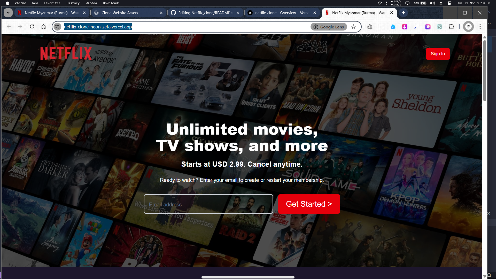
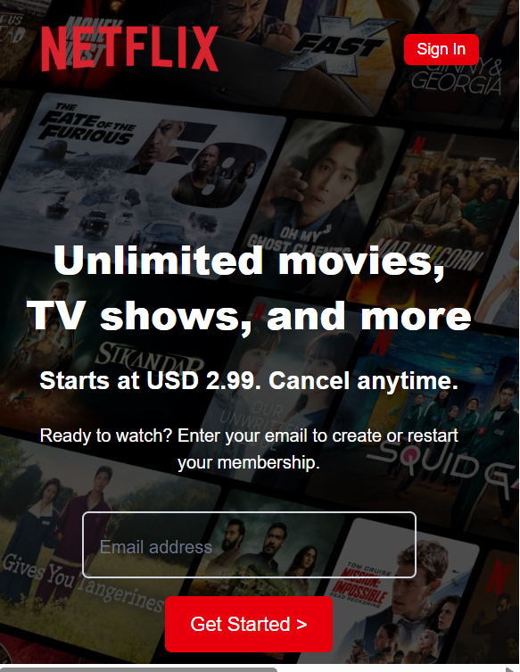

# 📺 Netflix Clone

A responsive Netflix homepage clone built using **HTML**, **Tailwind CSS**, and **JavaScript** — closely mimicking the real design with modern UI/UX elements.

[Live Demo 🚀](https://netflix-clone-neon-zeta.vercel.app/)

---

## ✨ Features

- 🎨 Fully responsive design across all screen sizes
- 🧭 Clean navigation bar with sign-in button
- 📦 Reason section, FAQ with collapsible toggles
- 💌 Call-to-action email input with floating label effect
- 🌍 Language select dropdown in the footer
- 📱 Mobile-first layout using Tailwind's utility classes

---

## 🛠️ Built With

- **HTML5**
- **Tailwind CSS**
- **JavaScript** (minimal)
- **Vercel** for deployment

---

## 📷 Screenshots

### 💻 Desktop View

### 📱 Mobile View

## 🚧 Upcoming Improvements

- Add animation to FAQ dropdowns
- Dark mode toggle
- Add real user authentication (Firebase/Auth0 in future)

## 📂 Folder Structure

netflix-clone/
│
├── index.html
├── style.css
├── script.js
├── assets/
│ └── (images, logos, icons)
└── README.md

## 🙋‍♂️ Author

**Ganeshyam Verma**

> Building real-world web projects one step at a time.

- GitHub: [@webdev-shyam](https://github.com/webdev-shyam)

- ---

## 📄 License

This project is for educational purposes only. No commercial use intended.

